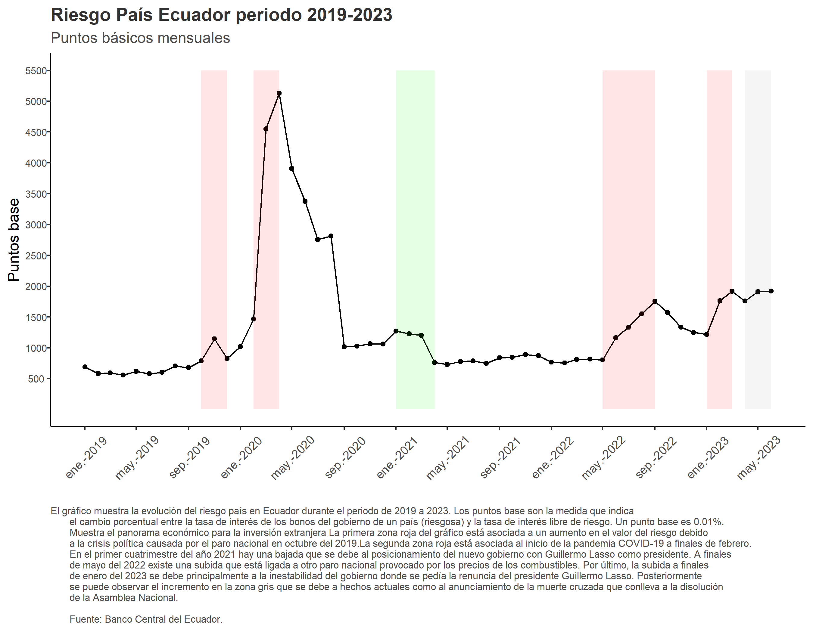

```{r setup, include = FALSE}
# Opciones de chunks
knitr::opts_chunk$set(echo=FALSE, message=FALSE, warning=FALSE)
```

# El latido de una economía

En la antigüedad el ser humano luchaba por la supervivencia y la preservación de su especie enfrentando múltiples riesgos en su entorno. En contraste, hoy en día con sistemas globales interconectados, ¿contra qué objeto lucha el ser humano de un país como el Ecuador? ¿Cuál es una de las amenazas inminentes, pero poco percibidas para los ecuatorianos?

La respuesta no es una sola, ya que existen varias conflictivas, como corrupción, inestabilidad política y económica, entre otras. Sin embargo, hay un objeto que suele pasar desapercibido, quizás por ser algo complicado de entender: el riesgo país o country risk premium. Este indicador económico pareciera ser nada más que una clase de calificación para evaluar a un país en términos de inversión, no obstante, no se suele dimensionar bien cómo esa puntuación influye a todo el marco económico. Sin embargo, en medio de estas reflexiones, a menudo escuchamos voces que sostienen que el riesgo país es algo que no tiene efectos tangibles en la vida cotidiana de la ciudadanía. Pero esta es una suposición errada, una percepción que subestima la verdadera influencia que tiene el indicador. 

El riesgo país es un ente vivo y dinámico que interactúa con todos los niveles de la economía, y que puede ser el viento que impulse o la tempestad que hunde nuestra economía. A continuación, abordaremos la definición del riesgo país y lo que implica para los ecuatorianos. 

# Desentrañando al objeto: ¿qué es el riesgo país y cómo afecta al gobierno?
```{r}
library(shiny)
library(highcharter)
library(readxl)

# Definimos la UI para la aplicación
ui <- fluidPage(
  titlePanel("Riesgo país Ecuador 2004-2023"),
  
  sidebarLayout(
    sidebarPanel(
      dateRangeInput('dateRange',
                     label = 'Filtrado dinámico por fechas',
                     start = as.Date("2004-07-01"), 
                     end = as.Date("2023-06-01")
      ),
      helpText("Fuente: Banco Central del Ecuador. Los puntos base del riesgo país representan la diferencia 
               entre la tasa de rendimiento de la deuda de un país y la tasa libre de riesgo. Un mayor número de 
               puntos base indica un mayor riesgo percibido asociado con la inversión en ese país.")
    ),
    
    mainPanel(
      highchartOutput("countryRiskChart")
    )
  )
)

# Definimos el servidor para la aplicación
server <- function(input, output) {
  # Leemos los datos
  data <- reactive({
    df <- read_excel("Data/Puntos riesgo país.xlsx")
    df$Periodo <- as.Date(df$Periodo, format = "%d/%m/%Y")
    df
  })
  
  # Creamos el gráfico interactivo
  output$countryRiskChart <- renderHighchart({
    df <- data()
    df <- df[df$Periodo >= input$dateRange[1] & df$Periodo <= input$dateRange[2],]
    highchart() %>%
      hc_chart(type = "line") %>%
      hc_title(text = "", style = list(fontSize = "24px", fontWeight = "bold")) %>%
      hc_subtitle(text = "", style = list(fontSize = "12px")) %>%
      hc_xAxis(categories = df$Periodo, labels = list(rotation = -45)) %>%
      hc_yAxis(title = list(text = ""), labels = list(style = list(fontSize = "8px"))) %>%
      hc_plotOptions(
        series = list(
          color = 'black',
          marker = list(
            enabled = TRUE,
            fillColor = 'black',
            radius = 2
          )
        )
      ) %>%
      hc_add_series(name = "Riesgo país", data = df$`Puntos_base`)
  })
}

# Ejecutamos la aplicación 
shinyApp(ui = ui, server = server)

```

Anteriormente tienen a su disposición una serie de tiempo con todos los datos registrados del riesgo país en el Banco Central del Ecuador. El visualizador dinámico permite observar el indicador en cualquier período que se desee. Sin embargo, hay que conceptualizar: ¿qué representa el riesgo país? 

Antes de continuar, es necesario entender lo que es un bono. Un bono es, en esencia, un préstamo que un inversor hace a una entidad, como a un gobierno o empresa. Al comprar un bono, se entrega dinero a la entidad, que promete devolverlo en una fecha futura, más una cantidad que corresponde al interés del préstamo. La tasa de interés implícita del bono, también conocida como el yield to maturity, es la recompensa que quien compra obtiene por realizar el servicio de prestamista y por asumir el riesgo de potencialmente no poder cobrar su dinero de vuelta.

El riesgo mencionado está profundamente vinculado al riesgo país. Cuando las empresas o gobiernos emiten bonos, éstos tendrán una tasa de interés como la mencionada. La tasa de interés de los bonos de un gobierno definen el riesgo país. Si un país tiene un riesgo país alto, los inversores ven como más probable que no pueda pagar su deuda, por lo que exigen una tasa de interés mayor para compensar ese riesgo. Entonces, a mayor riesgo país, mayor será la tasa de interés de los bonos emitidos por el gobierno de dicho país. 

La forma más común de calcular el riesgo país es tomar la tasa de interés de los bonos emitidos por los gobiernos de un país y restar la tasa de interés de los bonos emitidos por el gobierno estadounidense (llamados los bonos del Tesoro). El indicador mide la diferencia entre la tasa de interés del bono local y la del bono estadounidense. Se toman como referencia los bonos de EEUU puesto que se los considera “libres de riesgo”. La explicación que se suele dar a esto es que el gobierno estadounidense tiene la capacidad de cobrar impuestos a una de las poblaciones más ricas del planeta, lo que le proporciona un respaldo sólido para su deuda. [@hubbard_money_2011].

Se suele expresar el riesgo país en “puntos base” (BP, por sus siglas en inglés), donde uno equivale a 0.01% [@Fernando_2023]. Esta convención es comúnmente utilizada en el ámbito financiero para expresar cambios en tasas de interés de una manera precisa y fácilmente comprensible, puesto que a veces los cambios en tasas suelen ser muy pequeños. 

El indicador, entonces, se convierte en una medida del estatus de deudor de un país. Una nación con un alto riesgo país puede tener dificultades para obtener financiamiento, puesto que, obviamente, ¿quién presta a quién tiene fama de nunca pagar? y ¿cómo pagar una deuda que no se invirtió bien sin que nadie más preste? Cuando el riesgo país es alto, significa que un país necesita pagar más dinero a manera de interés para poder tomar prestado dinero de inversionistas internacionales, lo que implica que no podrá pedir tanto prestado y reduce sus capacidades de gasto público. Esto significa menor capacidad de invertir en educación, salud, obra pública, trabajadores públicos e incluso no honrar las obligaciones del gobierno a los empleados y proveedores del sector público. 

# El ADN del Indicador: Factores en las variaciones del riesgo país

¿Por qué fluctúan las capacidades de honrar la deuda? Mayormente, son factores económicos y políticos los que determinan dicha posibilidad. Los factores económicos determinan la capacidad del gobierno de recaudar impuestos para pagar su deuda [@andrade_sanchez_alisis_2018]. En general, cualquier variable macroeconómica que evidencie el crecimiento y/o estabilidad de la economía reducirá el riesgo país, puesto que una buena economía permite al gobierno recaudar más impuestos u otros ingresos, facilitando el pago de la deuda externa. 

Por otro lado, factores políticos incluyen golpes de estado, cambios en la administración gubernamental, tensiones sociales, conflictos armados, incluso elecciones. Por ejemplo, un caso particularmente agravante en el Ecuador fue la decisión de cesar el pago de deuda externa en el año 2008, donde se registró uno de los valores históricos más altos del riesgo país [@copo_torres_riesgo_2016]. La información sobre el puntaje para el año 2008 la pueden comprobar en el gráfico dinámico proporcionado: al finalizar el año 2008 después de dicha decisión el valor subió hasta los 3604 puntos base y se comenzó el año 2009 con un valor de 4731 puntos base. Esto significa que el Ecuador pagaba 47 puntos porcentuales por encima de la tasa de interés de los bonos del tesoro (que raramente sube de 5%). 

A continuación se muestra el periodo 2019 a 2023 del indicador en el Ecuador. En el gráfico se puede evidenciar ciertas zonas ligadas a eventos históricos en el país que marcaron valores elevados o bajos. 

```{r}

```

La primera subida considerable, en octubre de 2019, sucede al mismo tiempo que el paro nacional durante el gobierno de Lenín Moreno. Este tipo de eventos pueden aumentar el riesgo país, ya que una situación de inestabilidad política puede dificultar la capacidad del gobierno para cumplir con sus obligaciones financieras. 

La segunda subida, y una de las más grandes históricamente, fue a finales de febrero del 2020, causada por un evento mundial, la pandemia de COVID-19. Los efectos de la pandemia fueron devastadores para los mercados petroleros globales. Para un país como Ecuador, donde los ingresos del petróleo representan una parte considerable de los ingresos públicos, la caída en los precios del petróleo supuso una disminución drástica en los recursos disponibles para pagar gastos del gobierno, lo que constituye una buena razón para que el riesgo país incremente considerablemente. El préstamo del Fondo Monetario Internacional, negociado alrededor de septiembre del 2020, brindó la liquidez necesaria al gobierno, por lo que se ve una caída significativa del indicador en ese mes [@noauthor_imf_nodate]. 

Después, se evidencia una moderada caída a principios del año 2021 relacionada a la victoria de Guillermo Lasso, candidato a la presidencia.  Lasso, con propuestas de gobierno amigables hacia la economía de mercado, representaba una opción más estable para inversionistas internacionales. Éstos contemplaban la posibilidad en la que el otro candidato, Andrés Arauz, entable reformas gubernamentales que no prioricen el pago de la deuda externa [@noauthor_ecuador_2021], debido su cercanía con Rafael Correa. Puesto que no se esperaba este resultado, el mercado financiero “corrigió” sus predicciones de forma casi inmediata cuando el 11 de abril se declaró la victoria de Lasso. 

En mayo del 2022 se encuentra una nueva subida relacionada a otro paro nacional e inestabilidad política preocupaban a los inversionistas internacionales. Poco después, en enero del 2023 se evidencia otra subida relacionada con la inestabilidad en el gobierno provocada por el juicio político al presidente Lasso. A continuación, la subida en la zona gris es la continuación de los hechos anteriores que llevaron a la muerte cruzada y la disolución de la Asamblea, que al momento de la redacción de este artículo, siguen desenvolviéndose [@noauthor_noticias_2021]. A la fecha de redacción de este artículo (principios del mes de agosto 2023) la puntuación más alta del riesgo país alcanzada en el Ecuador es de 2035 puntos base [@noauthor_banco_nodate], lo que ponen al Ecuador como uno de los país más riesgoso en la región, superando a Argentina. 

# Riesgo país y su impacto en la economía empresarial

No cabe duda de que el riesgo país es un indicador correlacionado con todo el panorama político económico e inclusive social de una nación, pero, ¿cuál es su impacto en el entorno empresarial de un país? Ya se ha mencionado una de las maneras indirectas en las que el riesgo país influye en la economía: un gobierno con alto costo de financiamiento tendrá menos dinero para comprar bienes y servicios, lo que reduce los ingresos de las empresas que hubieran sido proveedoras del Estado. Este efecto dominó está siempre presente en las economías de mercado, en donde las condiciones de un mercado afectan a casi todos los otros. 

Hay muchas formas en que un alto "riesgo país" puede afectar a las empresas. Una de las más importantes es cómo se valora o se calcula el valor de inversiones de empresas como proyectos, préstamos u otras empresas que se valoran y se venden a otras empresas. Existe un método que las grandes empresas usan, el modelo de valoración de activos de capital (CAPM)[@barrezueta_aplicacion_2021], para entender cuánto podrían ganar con sus inversiones, considerando los riesgos. Por ejemplo, el CAPM ayuda a decidir cuánto vale una fábrica, o una granja.

El método se basa en varios factores, entre ellos, cómo se espera que vaya la economía y las tasas de interés de los bonos del gobierno. El "riesgo país" influye directamente en estas tasas de interés. Si el riesgo país es alto, la fórmula puede decir que un activo, como una fábrica, vale más, pero no porque sea mejor, sino por el riesgo asociado. Esto puede hacer que las empresas piensen dos veces antes de invertir o comprar algo, porque el valor parece inflado por el riesgo y no por su verdadera calidad o potencial. Es como si las cosas se volvieran más caras en un ambiente de alto riesgo, lo que lleva a las empresas a ser más cautelosas al invertir.

# Riesgo país y su impacto en la economía personal
Es imperante preguntarse: al ecuatoriano promedio, que no es gerente general de grandes empresas ni servidor público, ¿por qué razón le importaría el nivel del riesgo país? La respuesta corta: el efecto dominó. Por esto, el riesgo país no es solo un concepto que flota en las alturas: se filtra hasta el núcleo de la economía personal. 

Hemos examinado ya lo que ocasiona la falta de disponibilidad del gobierno para invertir en educación, salud y demás: una peor educación, peores servicios de salud pública, son todas razones por las que un ecuatoriano promedio debería preocuparse. Y así mismo, debido al efecto dominó, el hecho de que proveedores y empleados del Estado no puedan recibir su remuneración afectarán a quienes dependían de ellos cuando les vendían víveres, entretenimiento, alojamiento, entre otros. El efecto dominó no discrimina, por lo que es particularmente despiadado. 

Cuando las empresas, por otro lado, perciben menos ingresos debido a ingresos que el Estado hubiera generado, dejan de contratar nuevos empleados, despiden a los existentes, reducen los beneficios laborales, o simplemente cierran, lo que también afecta al bolsillo del ecuatoriano promedio, por potenciales ingresos laborales perdidos. 

Existe un canal adicional por el que los efectos del riesgo país afectan al ecuatoriano promedio. Cuando el valor del indicador sube, el Estado considera financiarse de forma interna ya que quizás podría conseguir tasas de interés más bajas con cooperativas y bancos locales. El estado entonces empieza a consumir crédito financiero de bancos y cooperativas locales, lo que reduce la disponibilidad de crédito disponible para las personas comunes. Ante la dificultad de los bancos de conseguir fondos internacionales (también por el riesgo país), empiezan a subir las tasas de interés internas también. Incluso en un país en donde las tasas de interés son determinadas por el gobierno, como el Ecuador, esto significa que los créditos informales (el chulko) empiezan a cobrar mayores tasas al observar la falta de crédito formal disponible para ciudadanos ecuatorianos.

El ecuatoriano promedio está entonces arrinconado por el riesgo país desde tres diferentes canales: los efectos dominó del menor gasto público, los efectos dominó de la empresa debilitada y también una patada en el piso: no podrá endeudarse, o al menor a precio asequible. Por lo tanto, a pesar de que el concepto de riesgo país pueda parecer distante y abstracto, las repercusiones de su aumento afectan a cada individuo, desde la tasa de interés que paga por su préstamo hipotecario, hasta su seguridad laboral y su capacidad para mantener el costo de vida. Sin lugar a duda el riesgo país, a pesar de su naturaleza abstracta, tiene una influencia real y tangible en nuestras vidas cotidianas.

# Conclusión

Con la creciente globalización y la interdependencia de las economías, entender y manejar el riesgo país será crucial para navegar por el incierto océano de la economía global y tomar decisiones informadas. El riesgo país, al ser simplemente una medida de la probabilidad de pago de la deuda de un gobierno, no causa nada por sí solo. Sin embargo, lo que el indicador mide está lejos de ser solamente números en una computadora: debido a aquel efecto dominó, una mala reputación de deudor de un país afecta al gobierno, a las empresas y al ecuatoriano promedio. 

Al mirar hacia el futuro, las fluctuaciones del riesgo país en Ecuador serán sin duda de primera importancia para el futuro económico, social y político del país. Conscientes de su relevancia, es imperativo mantener una vigilancia constante sobre este indicador, y más que nada, motivar el voto informado, puesto que al político, igual que el ciudadano, mira por sus propios intereses. La diferencia es que al político, en un ambiente institucional y legal nublado como el del Ecuador, quizás no le interesa mucho las repercusiones de sus decisiones en el riesgo país, y no puede o no quiere comprender aquel efecto dominó que puede ocasionar. Los eventos electorales actuales afectan en tiempo real a la imagen de nuestro país ante el mundo, y si es que el Ecuador es incapaz de escoger a un grupo de personas que puedan volver a ordenar nuestro juego de dominó, las fichas solo continuarán cayendo. 

# Referencias
